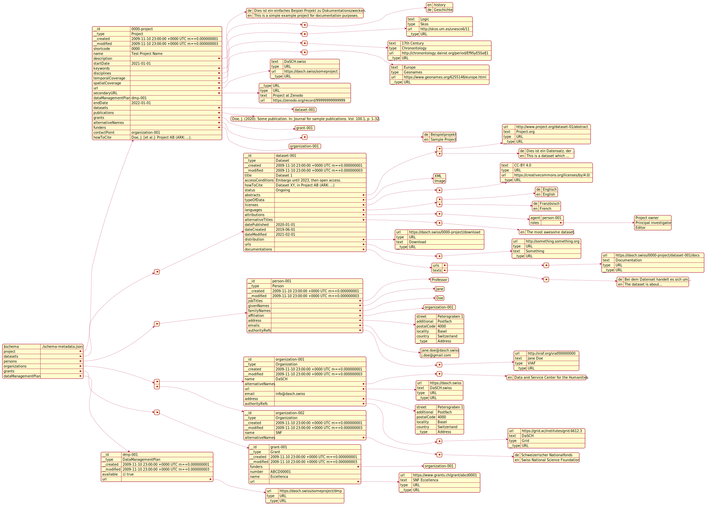

# Metadata
- [Metadata](#metadata)
  - [Data Types](#data-types)
    - [Overview](#overview)
    - [API Details](#api-details)
      - [URL](#url)
      - [Multi-Language Text](#multi-language-text)
  - [Resource Classes](#resource-classes)
  - [Properties on Resource Classes](#properties-on-resource-classes)
    - [Project](#project)
  - [API Details](#api-details-1)
    - [Project](#project-1)
    - [template](#template)
- [Old](#old)
  - [Domain Entities](#domain-entities)
  - [API representation](#api-representation)
    - [Macro structure](#macro-structure)
  - [Building the UML Diagrams](#building-the-uml-diagrams)


## Data Types

### Overview

| General             | Domain Model      | JSON API | RDF Mapping |
| ------------------- | ----------------- | -------- | ----------- |
| UUID                | UUID              | string   | literal     |
| string              | String            | string   | literal     |
| boolean             | Boolean           | boolean  | boolean     |
| URL                 | URL               | object   | schema:url  |
| date                | Date              | string   | ?           |
| multi-language text | MultiLanguageText | object   | ?           |


### API Details

#### URL

```json
{
    "__type": "URL",  // internal type: must always be `URL`
    "type": "URL",  // type: either `URL` or a supported authority file
    "url": "https://www.example.com",  // the actual URL
    "text": "17th Century"  // display text for the URL (optional)
}
```

The following values are accepted in `type`:

- URL
- Geonames
- Pleiades
- Skos
- Periodo
- Chronontology
- GND
- VIAF
- Grid


#### Multi-Language Text

```json
{
    "en": "history",
    "de": "Geschichte"
}
```

The keys must be two-character ISO languages.  
The values are the text in the corresponding language.

It is recommended to _always_ include english, furthermore any of the official languages of Switzerland can be used. Other languages _may_ be used but are not likely to be prioritized to be displayed in the front end.


## Resource Classes

| General              | Domain Model       | JSON API | JSON-LD Mapping | SWISSUbase mapping |
| -------------------- | ------------------ | -------- | --------------- | ------------------ |
| Project              | Project            | object   | ?               | ?                  |
| Dataset              | Dataset            | object   | ?               | ?                  |
| Person               | Person             | object   | ?               | ?                  |
| Organization         | Organization       | object   | ?               | ?                  |
| Address              | Address            | object   | ?               | ?                  |
| Grant                | Grant              | object   | ?               | ?                  |
| Data Management Plan | DataManagementPlan | object   | ?               | ?                  |


## Properties on Resource Classes

### Project

| General | Note          | Cardinality | Domain Model | JSON API | JSON-LD Mapping | SWISSUbase mapping |
| ------- | ------------- | ----------- | ------------ | -------- | --------------- | ------------------ |
| ID      | internal ID   | 1           | UUID         | string   | literal         | -                  |
| type    | internal type | 1           | String       | string   |                 |                    |


<!-- 

(1)
UUID id
String type
Date created
Date modified
Shortcode shortcode
String name
MultiLanguageText description
Date startDate

(1 - n)
Dataset[] datasets
MultiLanguageText[] keywords
MultiLanguageText[] disciplineTexts
URL[] disciplineRefs
MultiLanguageText[] temporalCoverageTexts
URL[] temporalCoverageRefs
URL[] spatialCoverages
Person[] funderPersons
Organization[] funderOrganizations

(1 - 2)
URL[] urls

Optional Fields
(0 - 1)
DataManagementPlan dataManagementPlan
Date endDate
Person contactPerson
Organization contactOrganization
String howToCite

(0 - n)
String[] publications
Grant[] grants
MultiLanguageText[] alternativeNames

 -->

## API Details

### Project

```json
{
    ...
}
```

<!-- TODO: add API stuff for all the classes -->


### template

| General | Domain Model | JSON API | JSON-LD Mapping | SWISSUbase mapping |
| ------- | ------------ | -------- | --------------- | ------------------ |
|         |              |          |                 |                    |


# Old

## Domain Entities

The domain entities (cf. clean architecture) implemented in the backend are structured as follows.

Note that cases, where the data model supposes a two different types, these are represented as two separate arrays for simplicity; these will be concatenated when the field is requested, and returned as one array through the API.

  
(Click on the image and open `raw` for a reasonable zoom level.)

## API representation

A metadata set can be serialized to JSON. This JSON data must conform to the [json-schema](schema-metadata.json).  
The following example illustrates how the JSON might look:

  
(Click on the image and open `raw` for a reasonable zoom level.)  
(Cf. `example.json` too.)

The JSON representation is "flat", i.e. not nested, so all top-level types are present in the first level of depth of the JSON document tree. All those objects have a unique `@id` property. Wherever this object is referenced further down in the document, this is done so by this ID.  
(NB: JSON schema does not allow for consistency checks of internal references, so the existence of an object with a given ID can not be guaranteed by JSON validation.)

This JSON contains the entirety of a dataset. Endpoints can be implemented that return only part of the data, e.g. only the project, a list of all datasets, a dataset with a certain ID, etc. However, these endpoints should return an exact subset of the data i the full representation of the metadata.

Other serializations of the data are possible. Eventually, a serialization in RDF should bee added.

### Macro structure

The overall structure of the JSON representation of a metadata-set should look like this:

```json
{
  "$schema": "...",
  "project": {
    ...
  },
  "datasets": [
    ...
  ],
  "persons": [
    ...
  ],
  "organizations": [
    ...
  ],
  "grants": [
    ...
  ],
  "dataManagementPlan": {
    ...
  }
}
```

`project` and `datasets` are required, `persons`, `organizations`, `grants` and `dataManagementPlan` are optional.

## Building the UML Diagrams

The UML diagrams are created using `PlantUML` which itself relies on `GraphViz`.

To create the diagrams, run `yarn run uml`. This requires Java and GraphViz to be installed.
