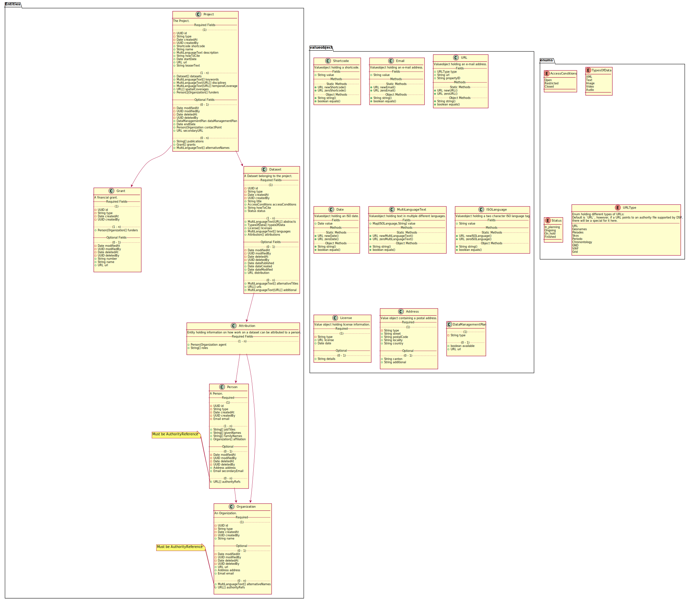

# Metadata

## Top Level Resource Classes

| General      | Domain Model | JSON API | RDF Mapping   | SWISSUbase mapping   |
| ------------ | ------------ | -------- | ------------- | -------------------- |
| Project      | Project      | object   | :Project      | StudyVersion (300)   |
| Dataset      | Dataset      | object   | :Dataset      | DatasetVersion (400) |
| Person       | Person       | object   | :Person       | Person (100)         |
| Organization | Organization | object   | :Organization | Institution (200)    |
| Grant        | Grant        | object   | :Grant        | ?                    |


## Properties on Resource Classes

### Project

| Property             | Note                                                           | Cardinality | Domain Model               | Domain Model Type         | JSON API             | JSON Type                                    | RDF Mapping                 | RDF type                 | RDF Cardinality | SWISSUbase mapping                                 |
| -------------------- | -------------------------------------------------------------- | ----------- | -------------------------- | ------------------------- | -------------------- | -------------------------------------------- | --------------------------- | ------------------------ | --------------- | -------------------------------------------------- |
| ID                   | internal ID                                                    | 1           | `id`                       | `UUID`                    | `__id`               | string                                       | IRI                         | IRI                      | -               | -                                                  |
| type                 | internal type                                                  | 1           | `type`                     | `String`                  | `__type`             | string                                       | `@type` / `rdf:type`        | rdf:type                 | -               | -                                                  |
| created at           | internal creation date                                         | 1           | `createdAt`                | `Date`                    | `__createdAt`        | string                                       | -                           | -                        | -               | -                                                  |
| created by           | ID of the user who created the resource                        | 1           | `createdBy`                | `User`                    | `__createdBy`        | string                                       | -                           | -                        | -               | -                                                  |
| modified at          | internal last modification date                                | 0-1         | `modifiedAt`               | `Date`                    | `__modifiedAt`       | string                                       | -                           | -                        | -               | -                                                  |
| modified by          | ID of the user who last the resource                           | 0-1         | `modifiedBy`               | `User`                    | `__modifiedBy`       | string                                       | -                           | -                        | -               | -                                                  |
| deleted at           | internal deletion date                                         | 0-1         | `deletedAt`                | `Date`                    | `__deletedAt`        | string                                       | -                           | -                        | -               | -                                                  |
| deleted by           | ID of the user who deleted the resource                        | 0-1         | `deletedBy`                | `User`                    | `__deletedBy`        | string                                       | -                           | -                        | -               | -                                                  |
| (†) short code       | deprecated internal short code                                 | 1           | `shortcode`                | `Shortcode`               | `shortcode`          | string                                       | `:hasShortcode`             | xsd:string               | 1               | ?                                                  |
| name                 | project name                                                   | 1           | `name`                     | `String`                  | `name`               | string                                       | `:hasName`                  | xsd:string               | 1               | Title (302)                                        |
| description          | project description                                            | 1           | `description`              | `MultiLanguageText`       | `description`        | object (multi-language text)                 | `:hasDescription`           | rdf:langString           | 1-n             | Abstract (314)                                     |
| start date           | start date of the project                                      | 1           | `startDate`                | `Date`                    | `startDate`          | string (`YYYY-MM-DD`)                        | `:hasStartDate`             | xsd:date                 | 1               | Start date (308)                                   |
| teaser text          | short teaser text for previewing the project                   | 1           | `teaserText`               | `String`                  | `teaserText`         | string                                       | `:hasTeaser`                | xsd:string               | 1               | ?                                                  |
| datasets             | references to all datasets that are part of the project        | 1-n         | `datasets`                 | `Dataset[]`               | `datasets`           | array of string (ID)                         | `:hasDataset`               | :Dataset                 | 1-n             | - (they link it in 400.1)                          |
| keywords             | keywords describing the project                                | 1-n         | `keywords`                 | `MultiLanguageText[]`     | `keywords`           | array of object (multi-language text)        | `:hasKeyword`               | rdf:langString           | 1-n             | ?                                                  |
| disciplines          | discipline of research the project belongs to                  | 1-n         | `disciplines`              | `MultiLanguageText/URL[]` | `disciplines`        | array of object (multi-language text or URL) | `:hasDiscipline`            | schema:URL or xsd:string | 1-n             | ?                                                  |
| temporal coverage    | time period covered by the project                             | 1-n         | `temporalCoverage`         | `MultiLanguageText/URL[]` | `temporalCoverage`   | array of object (multi-language text or URL) | `:hasTemporalCoverage`      | schema:URL or xsd:string | 1-n             | Period (311)                                       |
| spatial coverage     | geographic region covered by the project                       | 1-n         | `spatialCoverage`          | `URL[]`                   | `spatialCoverage`    | array of object (URL)                        | `:hasSpatialCoverage`       | schema:URL               | 1-n             | Geographical Space (312) / Geographical Area (313) |
| funders              | funding persons or organizations                               | 1-n         | `funders`                  | `Person/Organization[]`   | `funders`            | array of string (ID)                         | `:hasFunder`                | :Person or :Organization | 1-n             | Funding (318)                                      |
| primary URL          | project's primary URL, pointing to the DaSCH                   | 1           | `url`                      | `URL`                     | `url`                | object (`URL`)                               | `:hasURL`                   | schema:URL               | 1               | ? (329?)                                           |
| secondary URL        | optional secondary URL, pointing to a specific project website | 0-1         | `secondaryURL`             | `URL`                     | `secondaryURL`       | object (`URL`)                               | `:hasSecondaryURL`          | schema:URL               | 0-1             | ? (329?)                                           |
| data management plan | data management plan                                           | 0-1         | `dataManagementPlan`       | `DataManagementPlan`      | `dataManagementPlan` | string (ID)                                  | `:hasDataManagementPlan`    | :DataManagementPlan      | 0-1             | ?                                                  |
| end date             | end date of the project                                        | 0-1         | `endDate`                  | `Date`                    | `endDate`            | string (`YYYY-MM-DD`)                        | `:hasEndDate`               | xsd:date                 | 0-1             | End date (309)                                     |
| contact point        | contact person or organization                                 | 0-1         | `contactPoint`             | `Person/Organization`     | `contactPoint`       | string (ID)                                  | `:hasContactPoint`          | :Person or :Organization | 0-1             | Authors (306) -> only persons                      |
| how-to-cite          | representation how to correctly cite the project               | 1           | `howToCite`                | `String`                  | `howToCite`          | string                                       | `:hasHowToCite`             | xsd:string               | 0-1             | ?                                                  |
| publications         | scientific works published in the context of the project       | 0-n         | `publications`             | `String[]`                | `publications`       | array of string                              | `:hasPublication`           | xsd:string               | 0-n             | Publications (319)                                 |
| grants               | financial grants granted to the project                        | 0-n         | `grants`                   | `Grant[]`                 | `grants`             | array of string (ID)                         | `:hasGrant`                 | :Grant                   | 0-n             | ?                                                  |
| alternativeNames     | alternative names of the project                               | 0-n         | `alternativeNames`         | `MultiLanguageText[]`     | `alternativeNames`   | object (multi-language text)                 | `:hasAlternativeName`       | xsd:string               | 0-n             | Title (302)                                        |
| ___________________  | _________________________________                              | ___         | __________________________ | ________________________  | ____________________ | ___________________________                  | ___________________________ | ________________         | ___             | _____________________________                      |


### Dataset

| Property            | Note                                                                    | Cardinality | Domain Model               | Domain Model Type         | JSON API             | JSON Type                                    | RDF Mapping                 | RDF type                 | RDF Cardinality | SWISSUbase mapping             |
| ------------------- | ----------------------------------------------------------------------- | ----------- | -------------------------- | ------------------------- | -------------------- | -------------------------------------------- | --------------------------- | ------------------------ | --------------- | ------------------------------ |
| ID                  | internal ID                                                             | 1           | `id`                       | `UUID`                    | `__id`               | string                                       | IRI                         | IRI                      | -               | -                              |
| type                | internal type                                                           | 1           | `type`                     | `String`                  | `__type`             | string                                       | `@type` / `rdf:type`        | rdf:type                 | -               | -                              |
| created at          | internal creation date                                                  | 1           | `createdAt`                | `Date`                    | `__createdAt`        | string                                       | -                           | -                        | -               | -                              |
| created by          | ID of the user who created the resource                                 | 1           | `createdBy`                | `User`                    | `__createdBy`        | string                                       | -                           | -                        | -               | -                              |
| modified at         | internal last modification date                                         | 0-1         | `modifiedAt`               | `Date`                    | `__modifiedAt`       | string                                       | -                           | -                        | -               | -                              |
| modified by         | ID of the user who last the resource                                    | 0-1         | `modifiedBy`               | `User`                    | `__modifiedBy`       | string                                       | -                           | -                        | -               | -                              |
| deleted at          | internal deletion date                                                  | 0-1         | `deletedAt`                | `Date`                    | `__deletedAt`        | string                                       | -                           | -                        | -               | -                              |
| deleted by          | ID of the user who deleted the resource                                 | 0-1         | `deletedBy`                | `User`                    | `__deletedBy`        | string                                       | -                           | -                        | -               | -                              |
| title               | title of the dataset                                                    | 1           | `title`                    | `String`                  | `title`              | string                                       | `:hasTitle`                 | xsd:string               | 1               | Title (402)                    |
| access conditions   | conditions under which the dataset can be accessed                      | 1           | `accessConditions`         | `String`                  | `accessConditions`   | string                                       | `:hasAccessConditions`      | xsd:string               | 1               | Special permission (413)       |
| how-to-cite         | representation how to correctly cite the dataset                        | 1           | `howToCite`                | `String`                  | `howToCite`          | string                                       | `:hasHowToCite`             | xsd:string               | 1               | Bibliographical citation (409) |
| status              | the status of the dataset                                               | 1           | `status`                   | `String` (enum)           | `status`             | string (enum)                                | `:hasStatus`                | xsd:string               | 1               | ?                              |
| abstracts           | abstracts describing the dataset                                        | 1-n         | `abstracts`                | `MultiLanguageText/URL[]` | `abstract`           | array of object (multi-language text or URL) | `:hasAbstract`              | xsd:string or schema:URL | 1-n             | ?                              |
| types of data       | the types of data contained in the dataset                              | 1-n         | `typesOfData`              | `String[]` (enum)         | `typeOfData`         | array of string (enum)                       | `:hasTypeOfData`            | xsd:string               | 1-n             | ?                              |
| licenses            | the license(s) under which the data is made available                   | 1-n         | `licenses`                 | `License[]`               | `licenses`           | object (license)                             | `:hasLicense`               | :License                 | 1-n             | ?                              |
| languages           | the languages used in the dataset                                       | 1-n         | `languages`                | `MultiLanguageText[]`     | `languages`          | object (multi-language text)                 | `:hasLanguage`              | xsd:string               | 1-n             | ?                              |
| attributions        | attributions of contributions to the dataset by people or organizations | 1-n         | `attributions`             | `Attribution[]`           | `attributions`       | object (attribution)                         | `:hasQualifiedAttribution`  | prov:Attribution         | 1-n             | ?                              |
| date published      | publication date of the dataset                                         | 0-1         | `datePublished`            | `Date`                    | `datePublished`      | string                                       | `:hasDatePublished`         | xsd:date                 | 0-1             | ?                              |
| date created        | creation date of the dataset                                            | 0-1         | `dateCreated`              | `Date`                    | `dateCreated`        | string                                       | `:hasDateCreated`           | xsd:Date                 | 0-1             | ?                              |
| date modified       | last modification date of the dataset                                   | 0-1         | `dateModified`             | `Date`                    | `dateModified`       | string                                       | `:hasDateModified`          | xsd:Date                 | 0-1             | ?                              |
| distribution        | distribution URL of the entire dataset                                  | 0-1         | `distribution`             | `URL`                     | `distribution`       | object (URL)                                 | `:hasDistribution`          | schema:DataDownload      | 0-1             | ?                              |
| alternative titles  | alternative titles of the dataset                                       | 0-n         | `alternativeTitles`        | `MultiLanguageText[]`     | `alternativeTitles`  | array of object (multi-language text)        | `:hasAlternativeTitle`      | xsd:text                 | 0-n             | Title (402)                    |
| URLs                | URLs pointing to representations of this dataset                        | 0-n         | `urls`                     | `URL[]`                   | `urls`               | array of  object (URL)                       | `:hasURL`                   | schema:URL               | 0-n             | ?                              |
| additional          | additional information on the dataset                                   | 0-n         | `additional`               | `MultiLanguageText/URL[]` | `additional`         | array of object (multi-language text or URL) | `:hasAdditional`            | xsd:string or schema:URL | 0-n             | Additional Information (404)   |
| ___________________ | _______________________________________                                 | ___         | __________________________ | ________________________  | ____________________ | ___________________________                  | ___________________________ | ________________         | ___             | ________________               |


#### Status

Dataset status can have one of the following values:

- `In planning`
- `Ongoing`
- `On hold`
- `Finished`

#### Types of Data

The following values are allowed in "Types of Data":

- `XML`
- `Text`
- `Image`
- `Video`
- `Audio`


#### Access Conditions

The following values are allowed as access conditions:

- `open`
- `restricted`
- `closed`


### Person

| Property                  | Note                                                         | Cardinality | Domain Model               | Domain Model Type        | JSON API                  | JSON Type                   | RDF Mapping                    | RDF type         | RDF Cardinality | SWISSUbase mapping             |
| ------------------------- | ------------------------------------------------------------ | ----------- | -------------------------- | ------------------------ | ------------------------- | --------------------------- | ------------------------------ | ---------------- | --------------- | ------------------------------ |
| ID                        | internal ID                                                  | 1           | `id`                       | `UUID`                   | `__id`                    | string                      | IRI                            | IRI              | -               | -                              |
| type                      | internal type                                                | 1           | `type`                     | `String`                 | `__type`                  | string                      | `@type` / `rdf:type`           | rdf:type         | -               | -                              |
| created at                | internal creation date                                       | 1           | `createdAt`                | `Date`                   | `__createdAt`             | string                      | -                              | -                | -               | -                              |
| created by                | ID of the user who created the resource                      | 1           | `createdBy`                | `User`                   | `__createdBy`             | string                      | -                              | -                | -               | -                              |
| modified at               | internal last modification date                              | 0-1         | `modifiedAt`               | `Date`                   | `__modifiedAt`            | string                      | -                              | -                | -               | -                              |
| modified by               | ID of the user who last the resource                         | 0-1         | `modifiedBy`               | `User`                   | `__modifiedBy`            | string                      | -                              | -                | -               | -                              |
| deleted at                | internal deletion date                                       | 0-1         | `deletedAt`                | `Date`                   | `__deletedAt`             | string                      | -                              | -                | -               | -                              |
| deleted by                | ID of the user who deleted the resource                      | 0-1         | `deletedBy`                | `User`                   | `__deletedBy`             | string                      | -                              | -                | -               | -                              |
| job titles                | job titles of the person                                     | 1-n         | `jobTitles`                | `String[]`               | `jobTitles`               | array of string             | `:hasJobTitle`                 | xsd:string       | 1-n             | Title (102)                    |
| given names               | the given names/first names of the person                    | 1-n         | `givenNames`               | `String[]`               | `givenNames`              | array of string             | `:hasGivenName`                | xsd:string       | 1               | First Name (104)               |
| family name(s)            | the family name(s) of a person                               | 1-n         | `familyNames`              | `String[]`               | `familyNames`             | array of string             | `:hasFamilyName`               | xsd:string       | 1               | Last Name (103)                |
| affiliation               | the organizations a person is affiliated to                  | 1-n         | `affiliation`              | `Organization[]`         | `affiliation`             | array of string (ID)        | `:hasAffiliation`              | :Organization    | 1-n             | Affiliated institution (114)   |
| address                   | the postal address of the person                             | 0-1         | `address`                  | `Address`                | `address`                 | object (Address)            | `:hasAddress`                  | :Address         | 0-1             | Private address (112)?         |
| e-mail                    | the primary e-mail address                                   | 0-1         | `email`                    | `Email`                  | `email`                   | string                      | `:hasEmail`                    | xsd:string?      | 0-1             | Email (107)                    |
| secondary e-mail          | the secondary e-mail address                                 | 0-1         | `secondaryEmail`           | `Email`                  | `secondaryEmail`          | string                      | `:hasSecondaryEmail`           | xsd:string?      | 0-1             | -                              |
| authority file references | references to the person's entry in external authority files | 0-n         | `authorityFileReferences`  | `URL[]`                  | `authorityFileReferences` | object (URL)                | `:hasAuthorityFileReference`   | schema:URL       | 0-n             | Orcid (113) -> NB: Orcid only! |
| ___________________       | _______________________________________                      | ___         | __________________________ | ________________________ | ____________________      | ___________________________ | ______________________________ | ________________ | ___             | ________________               |


### Organization

| Property                  | Note                                                               | Cardinality | Domain Model               | Domain Model Type        | JSON API                  | JSON Type                             | RDF Mapping                    | RDF type         | RDF Cardinality | SWISSUbase mapping |
| ------------------------- | ------------------------------------------------------------------ | ----------- | -------------------------- | ------------------------ | ------------------------- | ------------------------------------- | ------------------------------ | ---------------- | --------------- | ------------------ |
| ID                        | internal ID                                                        | 1           | `id`                       | `UUID`                   | `__id`                    | string                                | IRI                            | IRI              | -               | -                  |
| type                      | internal type                                                      | 1           | `type`                     | `String`                 | `__type`                  | string                                | `@type` / `rdf:type`           | rdf:type         | -               | -                  |
| created at                | internal creation date                                             | 1           | `createdAt`                | `Date`                   | `__createdAt`             | string                                | -                              | -                | -               | -                  |
| created by                | ID of the user who created the resource                            | 1           | `createdBy`                | `User`                   | `__createdBy`             | string                                | -                              | -                | -               | -                  |
| modified at               | internal last modification date                                    | 0-1         | `modifiedAt`               | `Date`                   | `__modifiedAt`            | string                                | -                              | -                | -               | -                  |
| modified by               | ID of the user who last the resource                               | 0-1         | `modifiedBy`               | `User`                   | `__modifiedBy`            | string                                | -                              | -                | -               | -                  |
| deleted at                | internal deletion date                                             | 0-1         | `deletedAt`                | `Date`                   | `__deletedAt`             | string                                | -                              | -                | -               | -                  |
| deleted by                | ID of the user who deleted the resource                            | 0-1         | `deletedBy`                | `User`                   | `__deletedBy`             | string                                | -                              | -                | -               | -                  |
| name                      | the name of the organization                                       | 1           | `name`                     | `String`                 | `name`                    | string                                | `:hasName`                     | xsd:string       | 1               | Name (201)         |
| URL                       | the organization's website                                         | 0-1         | `url`                      | `URL`                    | `url`                     | object (URL)                          | `:hasURL`                      | schema:URL       | 0-1             | Website (204)      |
| address                   | postal address of the organization                                 | 0-1         | `address`                  | `Address`                | `address`                 | object (Address)                      | `:hasAddress`                  | :Address         | 0-1             | Addresses (207)    |
| e-mail                    | e-mail address of the organization                                 | 0-1         | `email`                    | `Email`                  | `email`                   | string                                | `:hasEmail`                    | xsd:string       | 0-1             | Email (206)        |
| alternative names         | alternative names of hte organization                              | 0-n         | `alternativeNames`         | `MultiLanguageText[]`    | `alternativeNames`        | array of object (multi-language text) | `:hasAlternativeName`          | xsd:string       | 0-n             | Name (201)         |
| authority file references | references to the organization's entry in external authority files | 0-n         | `authorityFileReferences`  | `URL[]`                  | `authorityFileReferences` | array of object (URL)                 | `:hasAuthorityFileReference`   | schema:URL       | 0-n             | ?                  |
| ___________________       | _______________________________________                            | ___         | __________________________ | ________________________ | ____________________      | ___________________________           | ______________________________ | ________________ | ___             | ________________   |


### Grant

| Property      | Note                                    | Cardinality | Domain Model   | Domain Model Type           | JSON API        | JSON Type                    | RDF Mapping               | RDF type                 | RDF Cardinality | SWISSUbase mapping          |
| ------------- | --------------------------------------- | ----------- | -------------- | --------------------------- | --------------- | ---------------------------- | ------------------------- | ------------------------ | --------------- | --------------------------- |
| ID            | internal ID                             | 1           | `id`           | `UUID`                      | `__id`          | string                       | IRI                       | IRI                      | -               | -                           |
| type          | internal type                           | 1           | `type`         | `String`                    | `__type`        | string                       | `@type` / `rdf:type`      | rdf:type                 | -               | -                           |
| created at    | internal creation date                  | 1           | `createdAt`    | `Date`                      | `__createdAt`   | string                       | -                         | -                        | -               | -                           |
| created by    | ID of the user who created the resource | 1           | `createdBy`    | `User`                      | `__createdBy`   | string                       | -                         | -                        | -               | -                           |
| modified at   | internal last modification date         | 0-1         | `modifiedAt`   | `Date`                      | `__modifiedAt`  | string                       | -                         | -                        | -               | -                           |
| modified by   | ID of the user who last the resource    | 0-1         | `modifiedBy`   | `User`                      | `__modifiedBy`  | string                       | -                         | -                        | -               | -                           |
| deleted at    | internal deletion date                  | 0-1         | `deletedAt`    | `Date`                      | `__deletedAt`   | string                       | -                         | -                        | -               | -                           |
| deleted by    | ID of the user who deleted the resource | 0-1         | `deletedBy`    | `User`                      | `__deletedBy`   | string                       | -                         | -                        | -               | -                           |
| funders       | funding persons or organizations        | 1-n         | `funders`      | `Person|Organization[]`     | `funders`       | array of string (ID)         | `:hasFunder`              | :Person or :Organization | 1-n             | ?                           |
| number        | the official grant number               | 0-1         | `number`       | `String`                    | `number`        | string                       | `:hasNumber`              | xsd:string               | 0-1             | ?                           |
| name          | name of the grant type                  | 0-1         | `name`         | `MultiLanguageText`         | `name`          | object (multi-language text) | `:hasName`                | xsd:string               | 0-n             | ?                           |
| url           | url of the grant                        | 0-1         | `url`          | `URL`                       | `url`           | object (URL)                 | `:hasURL`                 | schema:URL               | 0-1             | ?                           |
| _____________ | _______________________________________ | ___         | ______________ | ___________________________ | _______________ | ________________             | _________________________ | ___________              | ___             | ___________________________ |


## Data Types

### Overview

| General             | Domain Model      | JSON API | RDF Mapping                  |
| ------------------- | ----------------- | -------- | ---------------------------- |
| UUID                | UUID              | string   | xsd:string                   |
| string              | String            | string   | xsd:string                   |
| boolean             | Boolean           | boolean  | xsd:boolean                  |
| URL                 | URL               | object   | schema:URL                   |
| date                | Date              | string   | xsd:date                     |
| multi-language text | MultiLanguageText | object   | xsd:string (with `@en` etc.) |


### API Details

#### URL

```jsonc
{
    "__type": "URL",  // internal type: must always be `URL`
    "type": "URL",  // type: either `URL` or a supported authority file
    "url": "https://www.example.com",  // the actual URL
    "text": "17th Century"  // display text for the URL (optional)
}
```

The following values are accepted in `type`:

- URL
- Geonames
- Pleiades
- Skos/unesco6
- Periodo
- Chronontology
- GND
- VIAF
- Grid


#### Text (Multi-Language)


Representation of the same text in multiple languages. (Minimum 1 language.)

The keys of the object must be a two character ISO language code string. The property can be any string in the according language.

```jsonc
{
  "en": // ISO language code
    "history", // string in said language
  "de": "Geschichte" // the same for another language
}
```

It is recommended to _always_ include english, furthermore any of the official languages of Switzerland can be used. Other languages _may_ be used but are not likely to be prioritized to be displayed in the front end.


#### Attribution

Attribution attributes one or more roles to a person or organization.

```jsonc
{
  "__type": "Attribution",
  "agent": "ID", // ID of a person ort organization
  "roles": [ // the roles of the person/organization
    "PI",
    "Editor"
  ]
}
```


#### Address

Representation of a postal address.

```jsonc
{
  "__type": "Address",
  "street": "Petersgraben 1",
  "additional": "Postfach",  // Can be c/o, post box or similar; is assumed to be the second address line. (optional)
  "postalCode": "4000",
  "locality": "Basel",
  "canton": "Basel-Stadt", // Organizational district like canton, state, etc. (optional)
  "country": "Switzerland"
}
```


#### License

Representation of a license.

```jsonc
{
  "__type": "License",
  "license": { // a URL object
    "__type": "URL",
    "text": "CC-BY 4.0",
    "type": "URL",
    "url": "https://creativecommons.org/licenses/by/4.0/"
  },
  "date": "2020-01-01", // the licensing date
  "details": "All XML files included in the dataset can be re-used under the CC BY 4.0 license." // additional information, e.g. license scope (optional)
}
```

#### Data Management Plan

```jsonc
{
  "__type": "DataManagementPlan",
  "available": true,
  "url": {
    "url": "https://dasch.swiss/someproject/dmp",
    "type": "URL",
    "__type": "URL"
  }
}
```


## Domain Model

The following UML diagram represents the domain entities:

  
(Click on the image and open `raw` for a reasonable zoom level.)

Note that cases, where the data model supposes a two different types, these are represented as two separate arrays for simplicity; these will be concatenated when the field is requested, and returned as one array through the API.


## JSON API

A metadata set can be serialized to JSON. This JSON data must conform to the [json-schema](schema-metadata.json).  
An example JSON dataset can be found [here](example.json).


The JSON representation is "flat", i.e. not nested, so all top-level types are present in the first level of depth of the JSON document tree. All those objects have a unique `@id` property. Wherever this object is referenced further down in the document, this is done so by this ID.  
(NB: JSON schema does not allow for consistency checks of internal references, so the existence of an object with a given ID can not be guaranteed by JSON validation.)


## RDF API

An RDF endpoint will be added eventually. The mappings are defined in the tables above.


<!-- TODO: update -->


------

## Development

The UML diagrams are created using `PlantUML` which itself relies on `GraphViz`.

To create the diagrams, run `yarn run uml`. This requires Java and GraphViz to be installed.
